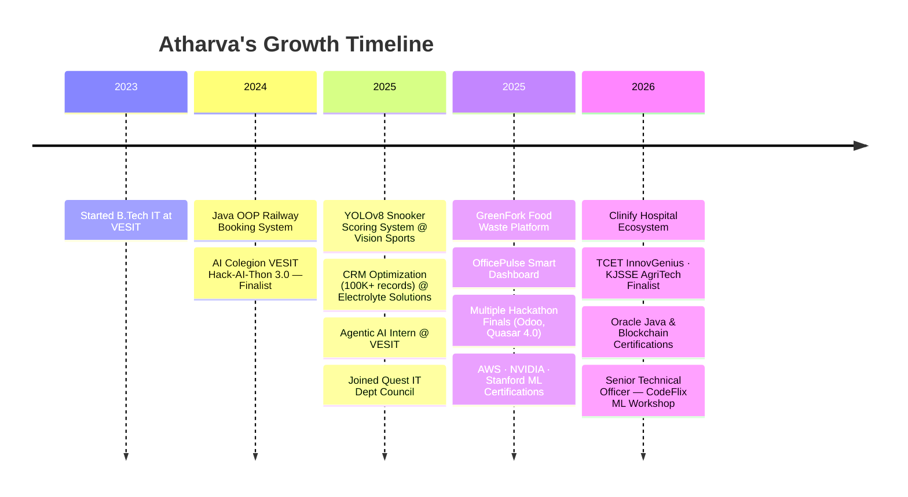
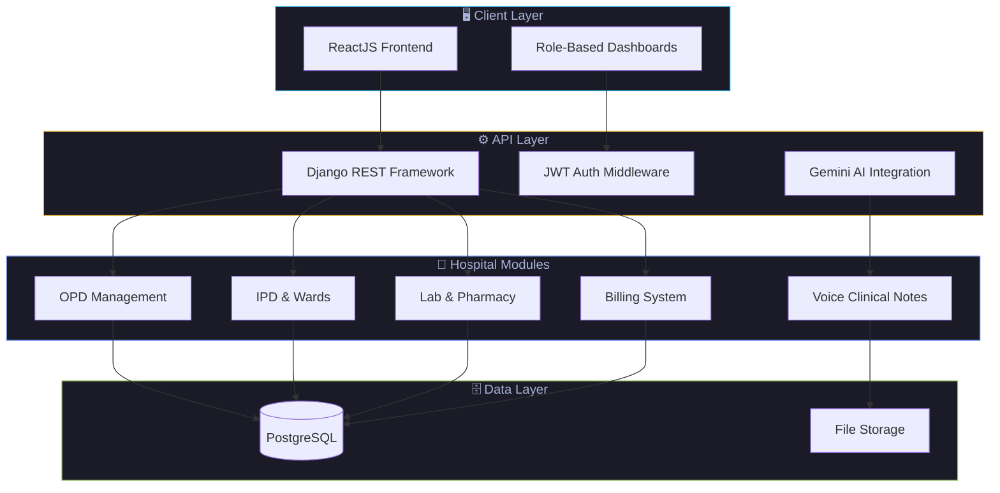
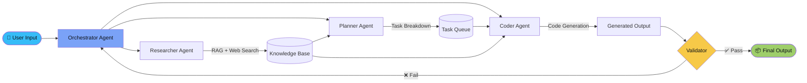
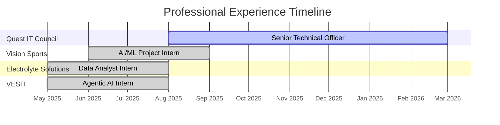
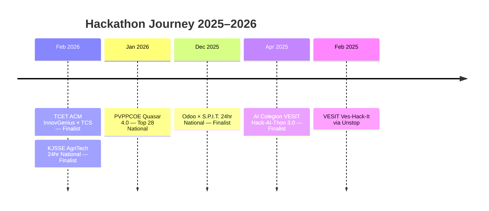

<div align="center">


<br/>

[](https://linkedin.com/in/atharva-lotankar-51824537b)
[](https://github.com/AtharvaLotankar11)
[](https://atharva-lotankar-portfolio.onrender.com/)
[](mailto:atharvalotankar11@gmail.com)
[](https://www.researchgate.net/profile/Atharva-Lotankar)

<br/>


</div>


## 🧬 About Me

<table>
<tr>
<td width="55%">

```yaml
name: Atharva Lotankar
role: B.Tech IT Student + Cloud Computing Minor
institute: VESIT, Chembur — Mumbai, India
cgpa: 9.90 / 10

focus_areas:
  - Agentic AI & Multi-Agent Systems
  - Full Stack Web & Mobile Development
  - Cloud Architecture (AWS · Azure · GCP)
  - Data Analytics & Business Intelligence
  - Computer Vision & Deep Learning

currently_building:
  - Zero Knowledge Proof Systems
  - AI-Powered Multi-Agent Platforms
  - Smart Hospital Ecosystems

open_to:
  - Open Source Collaboration
  - AI/ML Research Projects
  - EdTech & HealthTech Solutions

motto: "Transforming Ideas into Code 💻"
```

</td>
<td width="45%" align="center">


<br/>


</td>
</tr>
</table>


## 🗺️ Developer Journey




## 🏗️ Project Architecture — Clinify (Flagship)




## 🤖 AI/ML Workflow — Agentic Systems




## 💼 Experience



<br/>

<table>
<tr>
<td width="50%" valign="top">

### 🏢 Quest IT Dept Council — VESIT
`Senior Technical Officer` · Aug 2025 – Present

- 🎬 Led **CodeFlix** ML workshop → 30+ participants, 95% project success
- 🤖 Built Netflix clone with KNN recommendation engine
- 🎪 Assisted 200+ participants at GENESIS 2026 Hackathon (BMC alliance)
- 🌐 Architected QuestIT 2025-26 platform for 50+ members

</td>
<td width="50%" valign="top">

### 🎯 Vision Sports Reconnect Pvt. Ltd.
`AI/ML Project Intern` · Jun – Sep 2025

- 🎱 YOLOv8 snooker scoring system → **95% accuracy** across 100+ matches
- 🔍 Developed stateful game logic with automated foul detection
- 🎨 Web dashboard with 50+ live overlays & tagged replays
- 📊 Real-time analytics for 4-person team

</td>
</tr>
<tr>
<td width="50%" valign="top">

### ⚡ Electrolyte Solutions
`Data Analyst Intern` · May – Aug 2025

- 👥 Led 4-member team optimizing **100K+ CRM records** for Atomberg Fans
- 📊 Improved issue tracking visibility by **40%**
- 💡 Power BI dashboards → **25% efficiency boost**
- 🔄 Reduced processing time by **30%**

</td>
<td width="50%" valign="top">

### 🤖 VESIT
`Agentic AI Project Intern` · May – Aug 2025

- 👥 Led Multi-Agent AI Website Builder → **40% faster development**
- 💬 Built Human-Agent Chat, CoT, ReAct frameworks
- 🛠️ Applied Autogen, LangChain, n8n, MCP, RAG
- 🎓 Boosted team AI expertise by **35%**

</td>
</tr>
</table>


## 🚀 Featured Projects

<table>
<tr>
<td width="50%" valign="top">

### 🛒 NexCart AI — Predictive E-Commerce Platform
`Feb – Mar 2026` · Next.js · Django REST · LSTM · Ethereum · Web3

> AI-driven full-stack e-commerce platform with predictive personalization and blockchain-backed order tracking

- ✅ LSTM-based recommendation engine for **personalized** product suggestions
- ✅ Ethereum smart contracts for **immutable** order history & transparency
- ✅ Full-stack Next.js + Django REST architecture with real-time updates

</td>
<td width="50%" valign="top">

### 🏥 Clinify — Smart Hospital Ecosystem
`Jan 2026` · Django · PostgreSQL · ReactJS · Gemini AI

> Modular AI-enabled HIS covering OPD, IPD, lab, pharmacy & billing

- ✅ Reduced coordination effort by **50%**
- ✅ Gemini API for lab report summarization + voice notes
- ✅ Role-based dashboards cutting documentation time by **65%**

</td>
</tr>
<tr>
<td width="50%" valign="top">

### 📸 Instagram Wrapped 2025
`Jan 2026` · Python · Data Processing · Privacy-First

> Personalized behavioral insights from 1+ year of Instagram activity

- ✅ Chat, interaction & engagement trend summaries
- ✅ **100% private** — no data stored or shared
- ✅ Visual narrative generation from raw exports

</td>
<td width="50%" valign="top">

### 💼 OfficePulse — Smart Office Dashboard
`Jul – Oct 2025` · Chart.js · GROQ SDK · Socket.io · JWT

> AI-powered desk management & workspace analytics platform

- ✅ Booking efficiency boosted by **50%**
- ✅ GROQ AI analytics → workspace optimization **3x**
- ✅ Secure community chat with real-time updates

</td>
</tr>
<tr>
<td width="50%" valign="top">

### 🌱 GreenFork — Food Waste Management
`Jan – Apr 2025` · Firebase · IoT · Twilio · React

> Responsive platform reducing food waste via surprise bags

- ✅ Food waste reduced by **40%**
- ✅ Firebase real-time notifications across 3+ device types
- ✅ IoT composting system with Twilio SMS alerts

</td>
</tr>
</table>


## 🛠️ Tech Arsenal

<div align="center">

### 💻 Languages


### 🌐 Frameworks & Libraries


### 🗄️ Databases


### ☁️ Cloud & DevOps


### 🤖 AI/ML Tools


</div>

<br/>

<div align="center">

| Domain | Expertise Level |
|--------|----------------|
| AI/ML & Agentic Systems | `████████████████████` 90% |
| Full Stack Web Dev (MERN/Django) | `██████████████████░░` 85% |
| Cloud Architecture (AWS/Azure/GCP) | `████████████████░░░░` 80% |
| Data Analytics & BI | `████████████████████` 88% |
| Mobile Dev (Flutter) | `██████████████░░░░░░` 70% |
| DevOps & CI/CD | `████████████░░░░░░░░` 65% |

</div>


## 📊 GitHub Analytics

<div align="center">


<br/><br/>


</div>


## 🏆 Achievements & Certifications

<details>
<summary><b>🎖️ Hackathon Achievements — Click to Expand</b></summary>

<br/>



</details>

<details>
<summary><b>📜 Certifications (2024–2026) — Click to Expand</b></summary>

<br/>

| Year | Issuer | Certification |
|------|--------|---------------|
| 2026 | Oracle Academy + VESIT | Java Programming & Database with SQL |
| 2025 | Kerala Blockchain Academy | Blockchain Foundation Program |
| 2025 | Google Cloud | Cloud Speech API · Vertex AI · Network Setup |
| 2025 | AWS Academy | Cloud Foundations |
| 2025 | NVIDIA | Deep Learning Fundamentals · AI Anomaly Detection |
| 2025 | University of Colorado (Coursera) | DWH Concepts, Design & Data Integration |
| 2025 | IBM (Coursera) | Cybersecurity Essentials |
| 2025 | DeepLearning.AI | AI Agentic Design Patterns with AutoGen |
| 2025 | Stanford (Coursera) | Supervised Machine Learning |
| 2025 | Udemy | Python Pro + Flutter Dev Bootcamp |
| 2024 | ISA VESIT | Raspberry Pi & Linux Bootcamp |

</details>

<details>
<summary><b>🌟 Additional Achievements — Click to Expand</b></summary>

<br/>

- 🛩️ **Bharat Space Education Research Centre** — Advanced Aircraft Design Workshop (Sep 2025)
- 🌍 **MYCA Foundation** — Climate Action Certifications (Mar 2024)
- 🎵 **Akhil Bhartiya Gandharva Mahavidyalay** — Excellence in Harmonium L1–L3 (Nov 2018)
- 🔬 **Dr. Homi Bhabha Balvaidnyanik Competition** — Certificate (Sep 2016)
- 🧮 **National Abacus & Mental Arithmetic** — Certificate of Award (Nov 2011)

</details>


## 🤝 Let's Connect

<div align="center">


<br/>

[](https://linkedin.com/in/atharva-lotankar-51824537b)
[](mailto:atharvalotankar11@gmail.com)
[](https://atharva-lotankar-portfolio.onrender.com/)
[](https://www.researchgate.net/profile/Atharva-Lotankar)

<br/>


</div>
